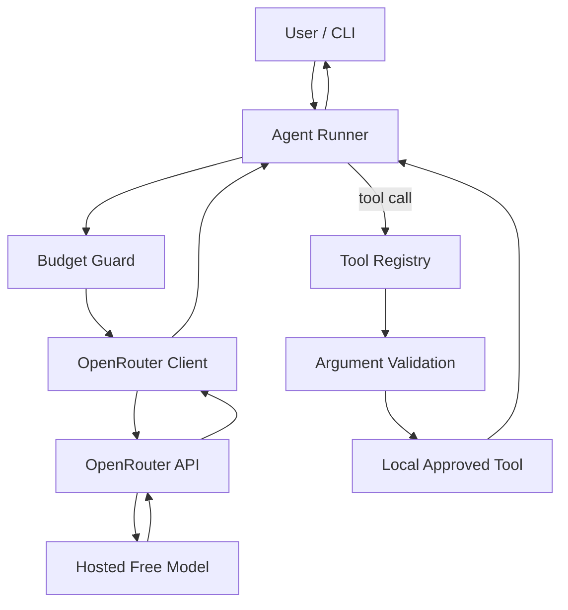

# AGENTS.md — OpenRouter Free-Model Agent Starter

> Build target: a practical, local application that runs AI agents through OpenRouter-hosted **free models**, with **no local GPU required**.
>
> Primary implementation: **Python 3.11+** using the OpenAI-compatible OpenRouter Chat Completions API.
>
> Default model: `openrouter/free`
>
> Last reviewed against public docs: 2026-09-27.

---

## 1. Mission

Build a clean, understandable agent framework that a developer can run on an ordinary laptop.

The application must:

1. Send all model inference to OpenRouter; never require a local model or GPU.
2. Work with an OpenRouter API key stored in an environment variable.
3. Default to OpenRouter's free-model router.
4. Allow the model to call a small set of explicitly registered tools.
5. Execute tool calls locally, validate their arguments, return tool results to the model, and continue the agent loop.
6. Prevent infinite loops and accidental request-quota exhaustion.
7. Keep model choice configurable rather than hard-coding a transient free model.
8. Support interactive CLI use first.
9. Include tests that do not require live API calls.
10. Keep the architecture easy to extend to multiple agents later.

This repo is an educational/starter framework, not a framework-within-a-framework. Favor readable Python and small modules over heavy dependencies.

---

## 2. Non-goals

Do **not**:

- run local LLM inference;
- download model weights;
- require CUDA, ROCm, Metal acceleration, Ollama, LM Studio, vLLM, or llama.cpp;
- embed API keys in source code;
- give the model unrestricted shell access;
- let the model execute arbitrary Python;
- let retries run without a hard upper bound;
- silently ignore malformed tool arguments;
- rely on one named free model always being available;
- expose hidden model reasoning or chain-of-thought;
- build a complex web UI before the CLI is reliable.

---

## 3. Current OpenRouter assumptions

Use these as implementation assumptions, but keep the relevant values configurable because service behavior can change.

### API

OpenRouter exposes an OpenAI-compatible API at:

```text
https://openrouter.ai/api/v1
```

Use:

```text
POST /chat/completions
```

Authentication:

```text
Authorization: Bearer $OPENROUTER_API_KEY
```

Optional attribution headers may be configured:

```text
HTTP-Referer: <your app URL>
X-Title: <your app name>
```

### Free models

Default to:

```text
openrouter/free
```

This is preferable to hard-coding a specific free model because OpenRouter can route to an available free model that satisfies requested features.

Also support a user-selected model, for example a model ID ending in `:free`, through:

```text
OPENROUTER_MODEL=provider/model:free
```

Never assume every free model supports tool calling, structured output, vision, or the same context size.

### Rate-limit awareness

The current public free tier is constrained enough that an agent loop must be conservative. Treat every model call as a scarce resource.

Implementation requirements:

- default maximum model calls per user turn: `8`;
- default maximum tool calls per user turn: `12`;
- no automatic retry storm;
- retry only transient failures;
- default transient retry count: `2`;
- exponential backoff with jitter;
- immediately stop on authentication errors;
- surface rate-limit errors clearly;
- record request counts in logs.

Do not implement logic intended to evade quotas or service limits.

---

## 4. Recommended stack

Use these dependencies unless there is a strong reason not to:

```text
python >= 3.11
openai
pydantic >= 2
python-dotenv
httpx
tenacity
rich
pytest
pytest-asyncio
```

Optional later:

```text
fastapi
uvicorn
```

Prefer `pyproject.toml`.

Do not introduce LangChain, LangGraph, CrewAI, AutoGen, or another orchestration framework in the initial implementation. The goal is to understand and own the agent loop.

---

## 5. Repository layout

Create this structure:

```text
openrouter-free-agent/
├─ AGENTS.md
├─ README.md
├─ pyproject.toml
├─ .env.example
├─ .gitignore
├─ src/
│  └─ free_agent/
│     ├─ __init__.py
│     ├─ config.py
│     ├─ client.py
│     ├─ messages.py
│     ├─ agent.py
│     ├─ runner.py
│     ├─ errors.py
│     ├─ logging_utils.py
│     ├─ tools/
│     │  ├─ __init__.py
│     │  ├─ base.py
│     │  ├─ registry.py
│     │  ├─ calculator.py
│     │  ├─ datetime_tool.py
│     │  └─ workspace_files.py
│     └─ multi_agent/
│        ├─ __init__.py
│        ├─ definitions.py
│        └─ orchestrator.py
├─ tests/
│  ├─ test_config.py
│  ├─ test_tool_registry.py
│  ├─ test_agent_loop.py
│  ├─ test_workspace_files.py
│  └─ fixtures/
└─ examples/
   ├─ basic_chat.py
   ├─ tool_agent.py
   └─ multi_agent_demo.py
```

If the repo already has a structure, adapt instead of destructively replacing it.

---

## 6. Environment configuration

Create `.env.example`:

```dotenv
OPENROUTER_API_KEY=
OPENROUTER_MODEL=openrouter/free
OPENROUTER_BASE_URL=https://openrouter.ai/api/v1

# Optional attribution
OPENROUTER_HTTP_REFERER=
OPENROUTER_APP_NAME=OpenRouter Free Agent Starter

# Agent safety / quota controls
AGENT_MAX_MODEL_CALLS=8
AGENT_MAX_TOOL_CALLS=12
AGENT_MAX_STEPS=12
AGENT_REQUEST_TIMEOUT_SECONDS=90
AGENT_RETRY_ATTEMPTS=2

# Workspace available to file tools
AGENT_WORKSPACE=./workspace

# Logging
LOG_LEVEL=INFO
```

Rules:

- `OPENROUTER_API_KEY` is required for live runs.
- Never log the complete API key.
- `.env` must be in `.gitignore`.
- Tests must not require a real `.env`.
- `OPENROUTER_MODEL` must remain easy to override.

---

## 7. Configuration object

Implement a Pydantic settings/config model.

Required fields:

```python
api_key: str
model: str = "openrouter/free"
base_url: str = "https://openrouter.ai/api/v1"
http_referer: str | None = None
app_name: str = "OpenRouter Free Agent Starter"
max_model_calls: int = 8
max_tool_calls: int = 12
max_steps: int = 12
request_timeout_seconds: float = 90
retry_attempts: int = 2
workspace: Path
log_level: str = "INFO"
```

Validation:

- reject zero/negative step limits;
- reject an empty model string;
- normalize and resolve the workspace path;
- create the workspace on startup when needed;
- do not create files outside it through agent file tools.

---

## 8. OpenRouter client

Implement a thin wrapper around the OpenAI Python SDK.

Conceptually:

```python
from openai import OpenAI

client = OpenAI(
    api_key=settings.api_key,
    base_url=settings.base_url,
    timeout=settings.request_timeout_seconds,
    default_headers={
        # add only when configured
        "HTTP-Referer": settings.http_referer,
        "X-Title": settings.app_name,
    },
)
```

Do not pass headers with `None` values.

Expose one high-level method such as:

```python
complete(
    *,
    messages: list[dict],
    tools: list[dict] | None = None,
    tool_choice: str | dict | None = None,
    temperature: float | None = None,
) -> ModelReply
```

The wrapper should:

- increment a per-run request counter;
- enforce the model-call budget before sending;
- preserve raw response metadata useful for debugging;
- normalize tool calls into internal dataclasses/Pydantic models;
- classify common errors;
- retry only transient errors;
- never retry authentication/permission/configuration errors;
- never recurse.

Prefer non-streaming first. Add streaming only after the normal agent loop passes tests.

---

## 9. Internal message model

Keep an internal message representation so API-specific details do not leak everywhere.

Support roles needed for tool loops:

```text
system
user
assistant
tool
```

The assistant message must be able to carry:

- visible `content`;
- zero or more tool calls.

A tool-result message must carry:

- `tool_call_id`;
- tool name if useful internally;
- serialized result content.

Preserve tool-call IDs exactly.

---

## 10. Tool abstraction

A tool consists of:

1. name;
2. description;
3. JSON-schema-compatible argument schema;
4. local Python implementation;
5. side-effect classification;
6. timeout policy if applicable.

Define a base protocol/class similar to:

```python
class Tool(Protocol):
    name: str
    description: str
    side_effects: bool

    def openai_schema(self) -> dict: ...
    def execute(self, arguments: dict) -> ToolResult: ...
```

Use Pydantic models for tool arguments.

Never trust arguments because they came from a model.

The registry must reject:

- duplicate names;
- unknown tools;
- malformed arguments.

Tool errors should be returned to the model as concise structured results when safe, rather than crashing the whole runner.

Example result:

```json
{
  "ok": false,
  "error": "validation_error",
  "message": "Expression is required."
}
```

---

## 11. Initial tools

Implement only narrow, reviewable tools.

### 11.1 Calculator

Name:

```text
calculator
```

Input:

```json
{
  "expression": "12 * (3 + 4)"
}
```

Safety requirement:

Do not use raw `eval()`.

Implement a small AST-based arithmetic evaluator that allows only:

- integers/floats;
- `+`, `-`, `*`, `/`, `//`, `%`, `**`;
- unary `+` / `-`;
- parentheses.

Reject:

- attribute access;
- names;
- function calls;
- imports;
- strings;
- comprehensions;
- excessively large expressions/exponents.

### 11.2 Current date/time

Name:

```text
current_datetime
```

Inputs:

```json
{
  "timezone": "UTC"
}
```

Use the standard `zoneinfo` package.

Reject unknown timezones with a clear error.

### 11.3 Workspace file listing

Name:

```text
list_workspace_files
```

Limit all access to `AGENT_WORKSPACE`.

Return relative paths.

Ignore hidden secret files by default.

### 11.4 Workspace text read

Name:

```text
read_workspace_text
```

Inputs:

```json
{
  "path": "notes/example.txt"
}
```

Rules:

- resolve path safely;
- enforce that the final resolved path is inside workspace;
- reject traversal such as `../../`;
- cap returned bytes/characters;
- text files only for v1.

### 11.5 Workspace text write

Name:

```text
write_workspace_text
```

Inputs:

```json
{
  "path": "output/report.md",
  "content": "...",
  "overwrite": false
}
```

Rules:

- workspace only;
- create parent folders when safe;
- default `overwrite=false`;
- never write `.env`;
- never write obvious key/credential files;
- treat this as a side-effecting tool.

For interactive CLI, ask the user to approve side-effecting tool calls before execution unless an explicit `--yes`/approved policy is set.

Do not add a generic shell tool to v1.

---

## 12. Agent definition

Create an `Agent` object with at least:

```python
name: str
instructions: str
model: str | None
tools: list[str]
max_steps: int | None
```

The model field overrides global configuration when provided.

Example:

```python
research_assistant = Agent(
    name="research_assistant",
    instructions=(
        "You are a careful assistant. Use tools only when they materially "
        "improve the answer. Never invent tool results. Keep answers concise."
    ),
    tools=["calculator", "current_datetime"],
)
```

Do not put secrets in agent instructions.

---

## 13. The core agent loop

Implement the loop directly and keep it easy to inspect.

Pseudo-code:

```python
def run_agent(agent, user_input, history=None):
    messages = build_messages(agent, history, user_input)

    for step in range(max_steps):
        enforce_model_call_budget()

        reply = client.complete(
            messages=messages,
            tools=registry.schemas_for(agent.tools),
        )

        messages.append(reply.as_assistant_message())

        if not reply.tool_calls:
            return RunResult(
                final_text=reply.content or "",
                messages=messages,
                usage=usage_tracker.snapshot(),
                stop_reason="final_answer",
            )

        for call in reply.tool_calls:
            enforce_tool_call_budget()

            tool_result = registry.execute(
                name=call.name,
                arguments_json=call.arguments,
                approval=approval_policy,
            )

            messages.append(
                tool_result.as_tool_message(tool_call_id=call.id)
            )

    raise MaxStepsExceeded(...)
```

Critical requirements:

- tool-call arguments arrive as JSON text; parse explicitly;
- support more than one tool call in a single assistant response;
- maintain the exact tool-call ID;
- after tools run, send their result messages back to the model;
- finish only when there are no tool calls or a hard stop occurs;
- never permit unbounded loops.

---

## 14. Budget tracking

Create a per-run tracker:

```python
@dataclass
class RunBudget:
    model_calls: int = 0
    tool_calls: int = 0
    max_model_calls: int = 8
    max_tool_calls: int = 12
```

Optionally record token usage if supplied in the API response.

Do not assume usage metadata is always identical across providers.

When the budget is reached:

- stop the run cleanly;
- tell the user what limit was reached;
- preserve the transcript for debugging;
- do not automatically start a second run.

---

## 15. Retry policy

Retry only errors likely to be transient, such as:

- connection failures;
- selected 5xx errors;
- temporary upstream/provider unavailability;
- selected rate-limit responses when a short retry is appropriate.

Do not retry:

- invalid API key;
- malformed request;
- invalid model ID that clearly requires user/config change;
- repeated tool-schema incompatibility;
- tool validation failures.

Backoff example:

```text
attempt 1: immediate request
retry 1: ~1–2 seconds
retry 2: ~2–4 seconds
then stop
```

Use jitter.

Respect server retry hints when the SDK exposes them.

---

## 16. Model selection strategy

### Default

```text
openrouter/free
```

### Explicit override

Allow:

```bash
OPENROUTER_MODEL="provider/model:free"
```

and:

```bash
python -m free_agent.cli --model "provider/model:free"
```

CLI override wins over environment configuration.

### Capability rule

If a selected model cannot handle requested tools/features:

1. return a clear configuration error;
2. recommend switching back to `openrouter/free` or another capability-compatible free model;
3. do not silently drop tool definitions.

Do not hard-code a list of “best” free models because availability changes.

A later optional feature may fetch the OpenRouter models catalog and display currently free models, but it is not required for v1.

---

## 17. CLI

Create an entry point:

```bash
free-agent
```

or:

```bash
python -m free_agent
```

Commands:

```text
free-agent chat
free-agent run "your task"
free-agent models
free-agent doctor
```

### `chat`

Interactive REPL.

Show:

- active model;
- remaining per-run model-call budget;
- concise tool-use notices;
- final answer.

Commands inside chat:

```text
/help
/model
/clear
/usage
/quit
```

### `run`

One-shot run:

```bash
free-agent run "Calculate 19*37 and save the answer to result.md"
```

Side-effecting tools require confirmation unless:

```bash
--yes
```

is supplied.

### `models`

For v1, it may simply print:

- current configured model;
- reminder that `openrouter/free` automatically selects among free models;
- a link/reference to the OpenRouter free-model collection.

Optional enhancement: call the models endpoint and filter entries whose prompt/completion price is zero. If implementing this, handle schema changes defensively.

### `doctor`

Validate without spending a model call when possible:

- Python version;
- package imports;
- API-key presence;
- base URL;
- writable workspace;
- current model configuration.

Add an optional flag:

```bash
free-agent doctor --live
```

that performs exactly one tiny live model request.

---

## 18. Conversation history

For v1, conversation state can live in memory for the current CLI session.

Do not implement long-term semantic memory yet.

Provide a simple history manager that:

- stores messages;
- can clear them;
- can trim old history using deterministic character/token-ish limits before requests become excessively large.

Do not summarize history with an extra model call by default because free-tier requests are scarce.

If trimming is necessary:

1. keep the system instructions;
2. keep recent turns;
3. keep tool-call/tool-result pairs together;
4. drop oldest ordinary turns first.

---

## 19. Multi-agent support

Implement only after the single-agent runner is reliable.

Multi-agent v1 should be a thin orchestration layer over the same `AgentRunner`, not a second execution engine.

Create three sample agents:

### Planner

Purpose:

- break a task into a short plan;
- must not execute tools.

### Worker

Purpose:

- execute the plan;
- has the calculator/date/workspace tools as configured.

### Reviewer

Purpose:

- inspect the worker's final artifact/text;
- identify concrete errors or omissions;
- must not rewrite endlessly.

Use a deterministic orchestrator:

```text
user task
  -> planner: one model call
  -> worker: normal bounded agent run
  -> reviewer: one model call
  -> optional single revision by worker
  -> final
```

Hard limits:

- planner: 1 call;
- reviewer: 1 call;
- worker revision: at most 1 extra pass;
- total orchestration still obeys the global request budget.

Do not implement open-ended agent-to-agent chatting.

Because free-tier requests are limited, keep single-agent mode the default.

---

## 20. Prompt/instruction design

Keep system instructions short and operational.

Baseline agent instruction:

```text
You are a tool-using assistant.

Rules:
- Answer the user's task directly.
- Use a tool only when it improves correctness or is required to take an action.
- Never claim a tool succeeded unless its returned result says it succeeded.
- Do not invent files, values, timestamps, or tool results.
- If tool arguments fail validation, correct them once when possible.
- Do not repeat the same failing tool call indefinitely.
- Do not reveal hidden chain-of-thought. Give concise conclusions and useful explanations.
```

Do not stuff API documentation into the runtime system prompt. Tool schemas and application code should carry mechanical details.

---

## 21. Logging and observability

Use standard Python logging plus Rich for CLI presentation.

Log at `INFO`:

- run ID;
- agent name;
- model identifier;
- model-call count;
- tool name;
- tool success/failure;
- stop reason;
- elapsed time.

At `DEBUG`, optionally log:

- sanitized request metadata;
- response IDs;
- token usage where available.

Never log:

- full API key;
- `.env` contents;
- authorization headers;
- secrets found inside workspace files.

By default, do not dump full prompts or file contents to logs.

---

## 22. Error model

Create custom exceptions such as:

```python
AgentError
ConfigurationError
AuthenticationError
RateLimitError
ProviderUnavailableError
ModelCapabilityError
ToolNotFoundError
ToolValidationError
ToolExecutionError
ApprovalRequiredError
MaxStepsExceeded
BudgetExceeded
```

The CLI must convert these into short actionable messages and a nonzero exit status where appropriate.

Do not show a giant SDK traceback in normal CLI mode.

Allow:

```bash
--debug
```

to expose traceback details.

---

## 23. Security requirements

These are mandatory.

### Secrets

- `.env` ignored by Git.
- API key only from environment/config injection.
- redact likely API keys from logs.
- never send unrelated local secrets to the model.

### File access

- workspace sandbox only;
- path traversal protection;
- symlink-aware containment checks;
- maximum file size;
- no `.env` reading/writing through tools;
- no home-directory crawling.

### Tool execution

- explicit allowlist registry;
- no arbitrary shell;
- no arbitrary code execution;
- schema validation before dispatch;
- confirmation for side effects.

### Network access

Do not give the model a generic unrestricted network-fetch tool in v1.

If a future HTTP tool is added:

- GET-only by default;
- explicit domain allowlist;
- block localhost/private/link-local targets;
- strict timeout;
- strict response size cap;
- no automatic credential forwarding.

---

## 24. Testing strategy

All core tests must work offline.

### Unit tests

Test:

- settings validation;
- tool schema generation;
- duplicate tool rejection;
- argument JSON parsing;
- calculator allowed expressions;
- calculator rejected expressions;
- workspace path traversal;
- overwrite protection;
- side-effect approval handling;
- model/tool budget counters.

### Agent-loop tests

Mock the OpenRouter/OpenAI SDK.

Cover:

#### Case A — plain answer

Mock model:

```text
assistant content: "Hello"
tool_calls: none
```

Expected:

- exactly one model call;
- final answer returned.

#### Case B — one tool call

Model response 1 requests calculator.

Tool returns result.

Model response 2 returns final text.

Expected:

- exactly two model calls;
- one tool call;
- correct `tool_call_id` round trip.

#### Case C — parallel/multiple tool calls

One model response contains two tool calls.

Expected:

- both are executed;
- both tool messages are appended;
- runner calls model again only after handling them.

#### Case D — malformed JSON arguments

Expected:

- no crash;
- tool result reports validation/parsing failure;
- loop remains bounded.

#### Case E — unknown tool

Expected:

- safe structured error;
- no dynamic import/execution.

#### Case F — infinite tool behavior

Model keeps requesting tools.

Expected:

- hard stop at configured budget/steps.

#### Case G — transient provider failure

Expected:

- bounded retries;
- correct retry count;
- eventual success or clean failure.

#### Case H — authentication failure

Expected:

- zero retries.

### Live integration test

Mark separately:

```python
@pytest.mark.live
```

Do not run by default.

It should:

- require `OPENROUTER_API_KEY`;
- send one tiny prompt;
- verify non-empty response;
- avoid tools unless testing tools explicitly;
- consume as few requests/tokens as possible.

---

## 25. README requirements

Write a beginner-friendly `README.md`.

Include:

1. what the project does;
2. “no GPU required” explanation;
3. architecture diagram in Mermaid;
4. prerequisites;
5. OpenRouter API-key setup;
6. virtual-environment/install steps;
7. `.env` setup;
8. first one-shot run;
9. interactive chat;
10. tool example;
11. model override;
12. rate-limit/quota warning;
13. testing;
14. troubleshooting;
15. security model;
16. extension guide.

Example quick start:

```bash
git clone <repo>
cd openrouter-free-agent

python -m venv .venv
```

macOS/Linux:

```bash
source .venv/bin/activate
```

Windows PowerShell:

```powershell
.venv\Scripts\Activate.ps1
```

Then:

```bash
pip install -e ".[dev]"
cp .env.example .env
```

User adds their key:

```dotenv
OPENROUTER_API_KEY=sk-or-v1-...
```

Run:

```bash
free-agent run "Explain recursion in three bullet points."
```

or:

```bash
free-agent chat
```

Never put a real key in README examples.

---

## 26. Architecture diagram

Put a version of this in the README:



Inference runs remotely through OpenRouter. Only the Python application and explicitly registered tools run locally.

---

## 27. Implementation order for Codex

Follow this order. Do not jump to the multi-agent demo first.

### Phase 1 — Project skeleton

Create:

- package layout;
- `pyproject.toml`;
- `.gitignore`;
- `.env.example`;
- empty tests;
- README skeleton.

Run import checks.

### Phase 2 — Config + client

Implement:

- settings;
- OpenRouter client wrapper;
- error normalization;
- bounded retry behavior.

Add mocked tests.

### Phase 3 — Tool system

Implement:

- tool protocol/base;
- registry;
- Pydantic argument validation;
- calculator;
- datetime.

Test offline.

### Phase 4 — Agent loop

Implement:

- messages;
- agent definition;
- runner;
- budget guards;
- sequential and multiple tool calls.

Use mock responses for tests.

### Phase 5 — Safe workspace tools

Implement:

- list;
- read;
- write;
- containment checks;
- approval.

Add security tests.

### Phase 6 — CLI

Implement:

- `run`;
- `chat`;
- `doctor`;
- `models`;
- Rich formatting;
- `--debug`;
- `--model`;
- `--yes`.

### Phase 7 — Documentation

Finish README and examples.

### Phase 8 — Optional multi-agent

Only when all previous tests pass.

Implement bounded planner/worker/reviewer orchestration.

### Phase 9 — Live smoke test

If and only if `OPENROUTER_API_KEY` is present:

- run one minimal live completion;
- do not burn requests through repeated manual tests.

---

## 28. Codex working rules

When building this repository:

1. Read this file before editing.
2. Inspect the existing repository before creating/replacing files.
3. Preserve user work.
4. Make small, coherent patches.
5. Run the most relevant tests after each phase.
6. Prefer offline mocked tests.
7. Do not spend OpenRouter requests merely to test code that can be mocked.
8. Never print or commit `OPENROUTER_API_KEY`.
9. Do not install local model runtimes.
10. Do not add a shell tool.
11. Do not add arbitrary code execution.
12. Keep dependencies minimal.
13. If API behavior is uncertain, isolate the assumption behind a small adapter.
14. If a specific free model fails, keep `openrouter/free` as the fallback/default rather than rewriting the architecture.
15. Before declaring completion, run the acceptance checklist below.

---

## 29. Acceptance checklist

The project is complete when all of the following are true.

### Setup

- [ ] Fresh Python 3.11+ environment installs successfully.
- [ ] No GPU/local LLM dependency exists.
- [ ] `.env.example` documents required config.
- [ ] `.env` is ignored.

### OpenRouter

- [ ] Base URL defaults to `https://openrouter.ai/api/v1`.
- [ ] Model defaults to `openrouter/free`.
- [ ] Model can be overridden via env/CLI.
- [ ] API key is never committed/logged.
- [ ] Calls are made through the OpenAI-compatible API.

### Agent loop

- [ ] Plain-answer path works.
- [ ] One-tool path works.
- [ ] Multiple tool calls work.
- [ ] Exact tool-call IDs are preserved.
- [ ] Invalid tool arguments do not crash the app.
- [ ] Max steps are enforced.
- [ ] Model-call budget is enforced.
- [ ] Tool-call budget is enforced.

### Tools

- [ ] Calculator does not use raw `eval()`.
- [ ] Datetime tool validates timezones.
- [ ] Workspace file tools cannot escape workspace.
- [ ] Overwrite behavior is safe.
- [ ] Side effects require approval by default.
- [ ] No generic shell/code-execution tool exists.

### Reliability

- [ ] Transient retries are bounded.
- [ ] Authentication failures are not retried.
- [ ] Rate-limit errors produce a useful message.
- [ ] Offline tests pass.

### UX

- [ ] `free-agent run` works.
- [ ] `free-agent chat` works.
- [ ] `free-agent doctor` works without spending a request by default.
- [ ] Active model is visible to the user.
- [ ] Tool activity is visible without exposing hidden reasoning.

### Docs

- [ ] README explains no-GPU architecture.
- [ ] README warns that free-model availability and limits can change.
- [ ] README explains how to switch models.
- [ ] README includes testing and troubleshooting.

---

## 30. Troubleshooting behavior

Document these common cases.

### `401` / authentication failure

Check:

- API key exists;
- key belongs to OpenRouter;
- key has no accidental quotes/spaces;
- base URL is OpenRouter.

Do not retry automatically.

### `429` / rate limit

Explain that the run hit a service/account/provider limit.

Do not loop aggressively.

Tell the user to:

- stop and retry later;
- reduce agent steps/tool loops;
- keep prompts smaller where appropriate;
- use fewer automatic retries.

Do not suggest circumventing provider limits.

### Selected model unavailable

If using a specific model:

- suggest `OPENROUTER_MODEL=openrouter/free`;
- keep the rest of the code unchanged.

### Tool calls not working

Check whether the explicitly selected model supports tool calling.

Do not pretend a tool ran if the model emitted plain text instead.

### Long context failure

Free endpoints may differ in available context/capability.

Keep history bounded and prefer small task-focused context.

---

## 31. Extension ideas after v1

These are optional and should not block the core build.

### Structured outputs

Add Pydantic-backed structured responses only after verifying the selected model/provider supports the requested response format.

### Streaming

Add streaming to CLI once non-streaming tool loops are stable.

Ensure tool-call fragments are reconstructed correctly before execution.

### Web API

Add FastAPI endpoints:

```text
POST /runs
GET /health
```

Do not expose the OpenRouter key to clients.

### Persistence

Add SQLite for:

- run metadata;
- transcripts;
- usage counters.

Never persist secrets by default.

### MCP

Consider adding MCP client/server integration as a separate module, not as a rewrite of the core runner.

### Retrieval

Add local document retrieval using CPU-friendly embeddings or a hosted embedding API only if needed. It must remain optional; the base agent must not require a GPU.

### Dynamic free-model discovery

Optionally query OpenRouter's model catalog and display currently zero-priced models and capabilities.

Cache the result briefly so the CLI does not waste requests.

---

## 32. Definition of “no local GPU required”

The completed app must be runnable on a normal CPU-only machine because:

```text
Laptop / CPU
  runs Python app + tools
        |
        v
     Internet
        |
        v
   OpenRouter API
        |
        v
Hosted model inference
```

The local computer handles orchestration and tool execution only.

No model weights are stored locally.

---

## 33. Reference implementation sketch

This is illustrative. Adapt names to the actual modules.

```python
from openai import OpenAI

client = OpenAI(
    api_key=os.environ["OPENROUTER_API_KEY"],
    base_url="https://openrouter.ai/api/v1",
)

messages = [
    {
        "role": "system",
        "content": "You are a concise tool-using assistant."
    },
    {
        "role": "user",
        "content": "What is 19 * 37?"
    },
]

tools = [
    {
        "type": "function",
        "function": {
            "name": "calculator",
            "description": "Evaluate a basic arithmetic expression.",
            "parameters": {
                "type": "object",
                "properties": {
                    "expression": {"type": "string"}
                },
                "required": ["expression"],
                "additionalProperties": False,
            },
        },
    }
]

response = client.chat.completions.create(
    model=os.getenv("OPENROUTER_MODEL", "openrouter/free"),
    messages=messages,
    tools=tools,
)
```

The production implementation must wrap this with:

- typed configuration;
- validation;
- budget enforcement;
- retries;
- tool dispatch;
- loop control;
- error handling;
- tests.

---

## 34. Source references

These are documentation references for maintainers. Re-check them if the platform changes.

- OpenRouter developer platform:
  `https://openrouter.ai/developers`
- OpenRouter free-model collection:
  `https://openrouter.ai/collections/free-models`
- OpenRouter free router:
  `https://openrouter.ai/openrouter/free`
- OpenRouter pricing / free limits:
  `https://openrouter.ai/pricing`
- OpenRouter tool-calling tutorial:
  `https://openrouter.ai/blog/tutorials/tool-calling/`
- OpenRouter model fallbacks:
  `https://openrouter.ai/docs/guides/routing/model-fallbacks`
- OpenAI Codex documentation:
  `https://developers.openai.com/codex/`

---

## 35. Final instruction to Codex

Build the project described above end-to-end.

Start with the smallest reliable single-agent implementation, complete its tests and CLI, and only then add the optional bounded multi-agent example.

At completion, provide:

1. a short architecture summary;
2. files created/changed;
3. commands to install and run;
4. test results;
5. any implementation deviations from this specification and why;
6. one minimal command the user can run after setting `OPENROUTER_API_KEY`.

Do not claim success unless the offline test suite passes.
