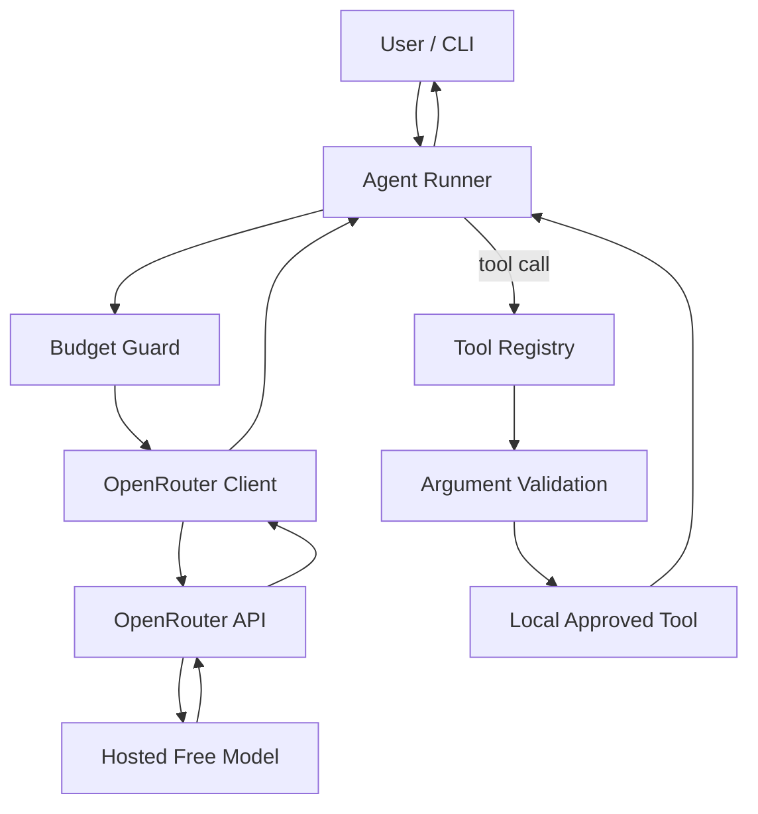

# Free Agent CLI — OpenRouter Agents Without a GPU

## 🍼 Feed my baby

If this project helps you, [support my family on PayPal](https://paypal.me/RuffyTrinidad).

A small Python agent that calls OpenRouter-hosted models and can use a few explicitly registered local tools. The default model is `openrouter/free`. The laptop runs Python, validation, and tools; model inference runs through OpenRouter. **No local GPU, model weights, or local model server are required.**



## Quick start

Requires Python 3.11+ and an OpenRouter account. The free router and free model availability can change; OpenRouter account and provider quotas still apply.

### Get and add your OpenRouter API key

1. Sign in to [OpenRouter](https://openrouter.ai/) and open [API Keys](https://openrouter.ai/settings/keys).
2. Create a key and copy it. Keep it private; never paste it into GitHub, an issue, or a commit.
3. From this project folder, copy the example settings file to `.env`:

   ```bash
   cp .env.example .env
   ```

4. Open `.env` in a text editor and replace the empty key value with your own key:

   ```dotenv
   OPENROUTER_API_KEY=your_openrouter_key_here
   OPENROUTER_MODEL=openrouter/free
   ```

5. Save the file. After installing below, run `free-agent doctor` to check the local setup. The ordinary doctor check does not make an API request. Run `free-agent doctor --live` only when you want to spend one request to test the key.

The app loads `.env` locally, and `.gitignore` excludes it from Git. You can also set `OPENROUTER_API_KEY` in your environment instead of creating `.env`. Never add your real key to `.env.example`.

### Install and run

```bash
python3 -m venv .venv
source .venv/bin/activate
pip install -e '.[dev]'
```

On Windows PowerShell, activate with `.venv\Scripts\Activate.ps1` and copy the settings file with `Copy-Item .env.example .env`. Then add your key as shown above.

```bash
free-agent doctor
free-agent run "Explain recursion in three bullet points."
free-agent chat
```

A tool example:

```bash
free-agent run "Calculate 19*37 using the calculator."
```

To let the model save a text file, the CLI shows the path, overwrite setting, size, and a short content preview before asking for approval. `--yes` approves these writes without a prompt:

```bash
free-agent run "Calculate 19*37 and save the answer to result.md" --yes
```

Files are limited to `AGENT_WORKSPACE` (default `./workspace`). The tool cannot read or write hidden or obvious credential paths, symlinks, or hard links, and caps text at 64 KiB. Workspace listings stop after 200 files or return an error if scanning exceeds 5,000 entries.

## Commands

| Command | Purpose |
| --- | --- |
| `free-agent run "task"` | One bounded turn |
| `free-agent chat` | Interactive in-memory conversation |
| `free-agent models` | Show current model and the free-model collection |
| `free-agent doctor` | Check local configuration without a model request |
| `free-agent doctor --live` | Make exactly one small live completion |

Use `python -m free_agent` if the `free-agent` executable is not on your path. Global options go before the command: `free-agent --model 'provider/model:free' run "task"` and `free-agent --debug run "task"`. The CLI model option wins over `OPENROUTER_MODEL`; otherwise `openrouter/free` is used. In chat, `/help`, `/model`, `/clear`, `/usage`, and `/quit` are available. Conversation history is held in memory and trimmed deterministically when it grows large.

## Limits and reliability

Each turn allows at most 8 model requests, 12 tool calls, and 12 steps by default. These are configurable in `.env`. Connection and temporary server failures get at most 2 retries with short jittered backoff. Authentication and rate-limit failures stop immediately. Retries count toward the model-request budget. The OpenAI SDK's own retry loop is disabled so these limits remain explicit.

Free models can differ in tool support and context length. If an explicitly selected model rejects tools, use `openrouter/free` or choose a currently tool-capable model. The runner never silently removes tool definitions. `free-agent models` intentionally makes no catalog request.

## Tests

```bash
pytest -q
```

The tests use fake SDK/model responses and require no API key or live traffic. Optional live checks after configuring a key: `free-agent doctor --live` or `pytest --live -m live`. Each spends one request.

## Security model

The model can call only registered tools: calculator, current date/time, list workspace files, read workspace text, and write workspace text. There is no shell, arbitrary Python, local model inference, or general network tool. Tool arguments are parsed as JSON and checked with Pydantic. File paths are resolved against the workspace and checked for traversal, symlinks, and hard links. The configured API base URL must use HTTPS. Writes require confirmation by default. Logs include request counts and tool names, without prompts, file contents, authorization headers, or API keys.

## Troubleshooting

- **401 or 403:** Check that `OPENROUTER_API_KEY` is an OpenRouter key with no extra quotes or spaces and that the base URL points to OpenRouter. These errors are not retried.
- **429:** An account, service, or provider limit was reached. Wait before retrying, reduce steps or prompt size, and avoid repeated runs.
- **Selected model unavailable:** Set `OPENROUTER_MODEL=openrouter/free` or pass `--model openrouter/free`.
- **Tool calls fail:** Check whether the selected model supports tool calling. The app reports a model/request error instead of claiming a tool ran.
- **Long context:** History is trimmed, but endpoint limits vary. Start a fresh chat with `/clear` or use a smaller task.
- **Write denied:** Approve the prompt, pass `--yes` for intentional writes, or check `AGENT_WORKSPACE` permissions.

## Extending the starter

Add a Pydantic argument model and a small tool class in `src/free_agent/tools/`, register it in `registry_for`, and add its name to the agent's tool list. Keep side effects explicit. The optional `multi_agent` package shows a fixed planner → worker → reviewer → at most one worker revision flow. It uses the same runner and shared budget; the CLI stays single-agent by default. See `examples/` for basic usage.

## 🍼 Feed my baby

If this project helps you, [support my family on PayPal](https://paypal.me/RuffyTrinidad).
